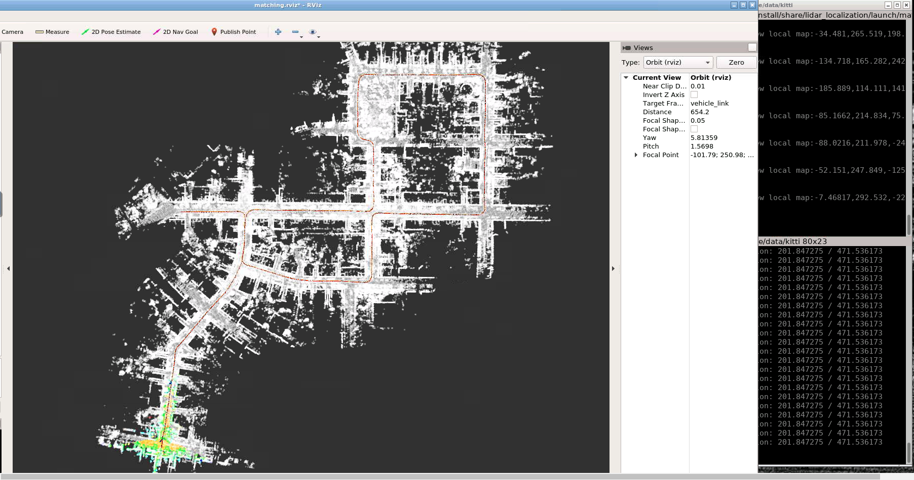
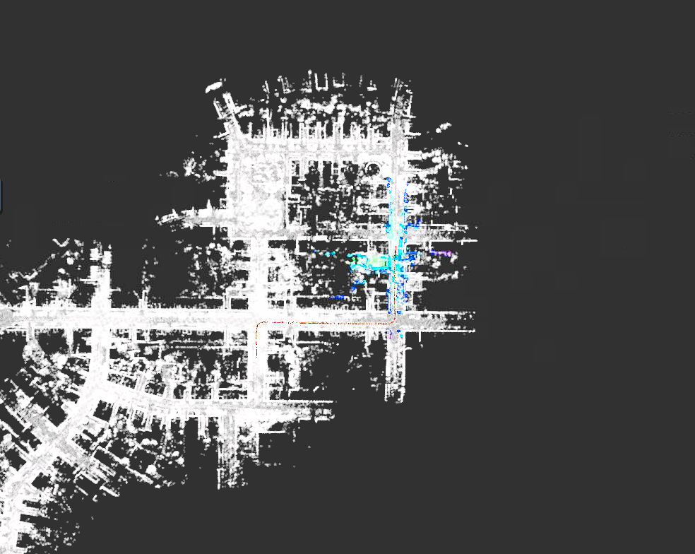
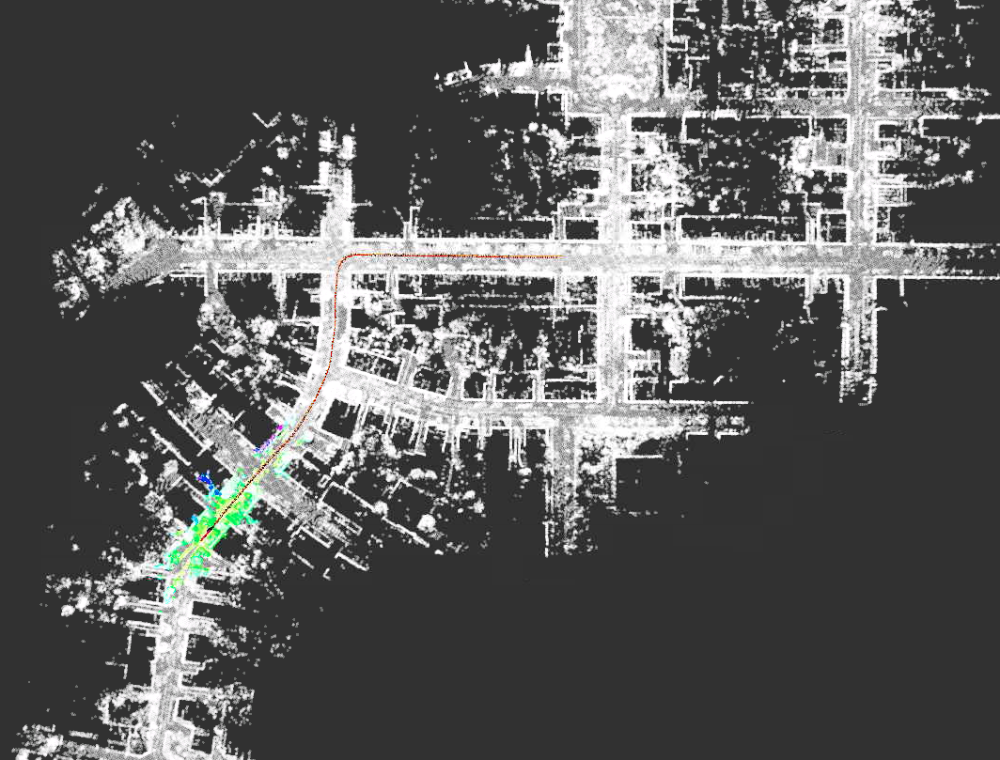

# Sensor Fusion: Lidar Odometry

---

从0秒开始结果:下图


从50秒开始结果:下图


从150秒开始结果:下图


以上是我的跑通截图,因为我的电脑内存只有8G,故无法建立完整地图,在部分地图的情况下从0s, 50s以及150s全局初始化均表现良好.

---

### 代码相关更改

代码改动量很少,但需要了解工程框架比较深入.

- 第一个改动是在一个**TODO**提示中.
`matching_flow.cpp`文件中的`UpdateMatching`函数:
```C++
    matching_ptr_->SetGNSSPose(current_gnss_data_.pose);
```

这句话的意思是初始化使用GNSS的方法,根据第一帧组合导航发来的位姿.这句代码看上去很合理,无论在哪个位置我都能根据第一个发来的位姿进行初始化,这样就能实现全局初始化了.但事实上仅仅写了这句代码还不能顺利全局初试化, 因为通过打印日志查看第一帧传来的位姿发现平移量都很相近无论从哪里开始. 这让人想到是否因为初始化使用的是相对位姿.果不其然在`gnss_data.cpp`中发现了初始化GNSS的代码
```C++
    geo_converter.Reset(latitude, longitude, altitude);
```
它每次都是使用第一帧的位姿作为原点进行相对位姿计算, 那每次的第一帧肯定都是原点位姿.

需要把原点经纬度位置固定下来.通过打印日志即可查看在0s初始化时的原点经纬度.
上句代码修改为:
```C++
    geo_converter.Reset(48.98265, 8.39046, 116.396);
```

即可实现全局初始化.